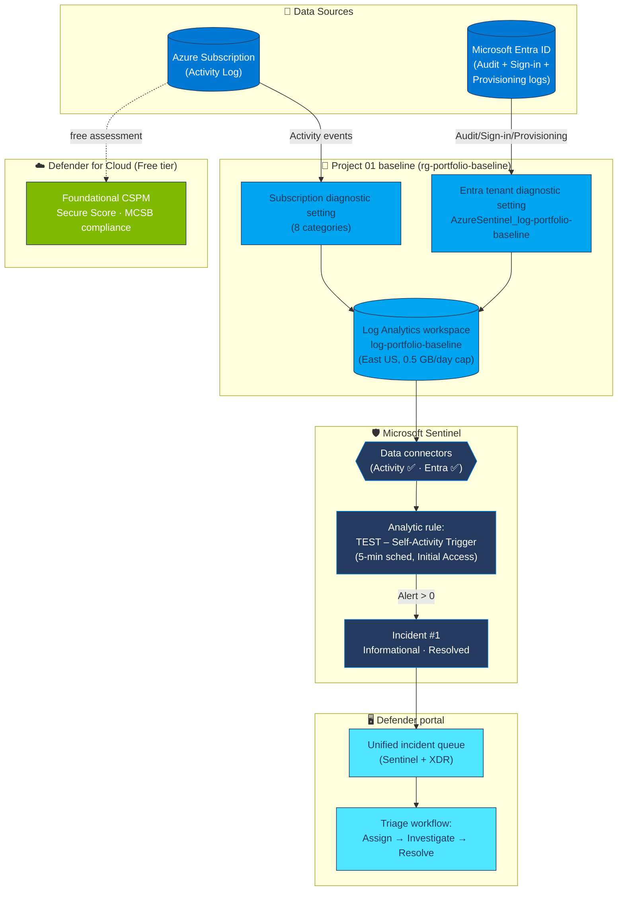

# Project 02 — Defender + Sentinel Tour

> **Microsoft Cybersecurity Architect Portfolio** · Project 02 of 9
> Paired cert: **SC-900 Microsoft Security, Compliance, and Identity Fundamentals** · ✅ Passed 2026-05-15 ([verify](https://learn.microsoft.com/api/credentials/share/en-us/KhayamKhan-6558/625F0AC6BCB169D2?sharingId=BC2D391EF5A95F66))
> Shipped: 2026-05-19
> By **Khayam Khan** · SOC Analyst → Cloud Security Architect · 🇵🇭 Philippines · [LinkedIn](https://www.linkedin.com/in/khankhayamk/)

---

## 1. What I Built

A working Microsoft Sentinel SIEM workspace with real telemetry flowing in, a detection rule that fired on my own activity, and a fully triaged synthetic incident, all built on the Project 01 baseline. Plus a field guide mapping eight Microsoft security portals to what they do, where they live, and which cert they appear on.

Concretely: Sentinel onboarded on `log-portfolio-baseline`, two free-tier data connectors active (Azure Activity, Microsoft Entra ID), a custom scheduled analytic rule that auto-generates incidents on subscription writes, end-to-end incident triage (assign → investigate → resolve with comment + classification), and Defender for Cloud running on the free Foundational CSPM tier as the always-on security posture baseline.

Where Project 01 set up the building, this is the security control room, the place I'll work from for the rest of the portfolio.

---

## 2. Problem Solved

**Problem**: SC-900 throws the entire Microsoft security ecosystem at you in one exam — Defender for Cloud, Defender XDR (Endpoint, Identity, Office, Cloud Apps), Sentinel, Entra ID Protection, Purview, Priva, Intune. The names blur together when you're studying from slides. The fastest way to internalize them is to **deploy the smallest possible version of each**, click through the portals, and write a field guide from what you actually saw.

It's also the natural starting point for the SOC analyst pivot: an empty Sentinel workspace is useless. A workspace with connected sources, a working detection rule, a fired incident, and a documented triage workflow is portfolio-worthy.

**Who hurts**: SC-900 candidates studying from theory only; SOC analysts who've used third-party SIEMs but never built one from scratch; cloud security engineers trying to demonstrate "I've actually deployed Sentinel" without setting up an enterprise lab.

**Why it matters**: My day job is SOC L1.5, and Sentinel/KQL is a daily tool I want to build from, not just consume. SC-200 (Project 05) and the Sentinel SOC Build-Out depend on having a working Sentinel workspace with real telemetry first. This project is the dependency, not the destination.

---

## 3. Technologies Used (and Why)

| Technology | Why I chose it | Alternative considered |
|---|---|---|
| **Microsoft Sentinel** | Cloud-native SIEM; native Azure integration; KQL is the same language used by Defender XDR, Log Analytics, and Defender for Cloud — single dialect across the whole Microsoft security stack | Splunk Cloud (more mature, $$$ for a lab); Elastic Cloud (great UI, weaker Azure integration) |
| **Azure Activity log connector** | Free, always-on, zero-configuration; covers every Azure resource change without per-resource setup | Diagnostic settings per resource (more granular but tedious to manage at scale) |
| **Microsoft Entra ID connector** | Captures identity-layer telemetry (audit + sign-in + provisioning) — the single most valuable data source for SOC analysts since "every breach is an identity breach" | None really — this is the canonical Entra → SIEM pipeline |
| **Defender for Cloud (Foundational CSPM)** | Free baseline; gives a Secure Score posture metric and Microsoft Cloud Security Benchmark compliance dashboard out of the box | Custom Azure Policy + manual posture management (orders of magnitude more work) |
| **Custom scheduled analytic rule** (KQL) | Lets me validate the full detection → alert → incident → triage pipeline end-to-end with a controllable trigger — without waiting for a real attack | Sentinel rule templates (premade but harder to deliberately trigger on lab traffic) |
| **0.5 GB daily ingestion cap** | One-click cost control; bounds worst-case daily cost at ~$1.20 regardless of what a runaway query or chatty connector does | Pay-per-GB with no cap (real risk on lab tenants — one bad rule could burn $30 in an afternoon) |
| **Policy exemptions (Waiver)** | Narrowly-scoped, time-limited deviation from Project 01's required-tag policies — the production-grade way to handle "platform-created child resource has no tag input field" | Disabling the policy entirely (loses governance everywhere else); switching policies to Audit-only (loses deny enforcement) |
| **Defender portal (security.microsoft.com)** | Microsoft's strategic direction — the "unified security operations platform" merging Sentinel SIEM with Defender XDR. Working here now means matching where the product is going, not where it was. | Azure portal Sentinel (legacy; some pages already redirect to Defender portal) |

---

## 4. Architecture

### Data flow narrative

1. **Project 01's subscription diagnostic setting** (already in place) ships every Activity Log event to `log-portfolio-baseline`. No Sentinel-side configuration needed — the moment Sentinel onboards onto this workspace, AzureActivity ingestion is already live (54 events visible within 10 minutes; 258 within a few hours).
2. **The Entra tenant diagnostic setting** (created via the Sentinel connector under the hood, named `AzureSentinel_log-portfolio-baseline`) ships audit + sign-in + provisioning logs from Entra to the same workspace. **First-activation lag is real here — ~45 minutes between Apply Changes and the first AuditLogs row** (documented in Section 12).
3. **Sentinel's scheduled analytic rule** runs every 5 minutes against the last 1 hour of AzureActivity, looking for any subscription write. When matches exceed 0, it generates an alert → an incident.
4. **The incident lands in the unified Defender portal queue**, where Sentinel and Defender XDR alerts share the same triage surface. Entities mapped (Account, IP) drive the Incident Graph.
5. **Defender for Cloud's Foundational CSPM** runs independently of Sentinel and scores the same subscription against Microsoft Cloud Security Benchmark, surfacing posture recommendations.

---

## 5. Trade-offs & Decisions

| Decision | Why | What I gave up |
|---|---|---|
| Free-tier connectors only (Activity, Entra Audit + Provisioning) | Costs <$3/month idle; sufficient telemetry for SC-900 lab + first detection rule | SignInLogs (real-world breach signal — requires Entra P1, deferred to SC-300 / Project 06) |
| Single tenant region (East US) | Project 01 baseline already locked here; cross-region adds latency on first-activation | Geo-redundancy (not needed for a lab) |
| 0.5 GB/day cap (not 1 GB or unlimited) | Worst-case cost ≤ $1.20/day; forces query discipline | Theoretical risk of dropped data on a noisy day — acceptable for lab |
| Pay-as-you-go pricing (not Commitment Tier) | Daily ingest is ~50–200 MB — Commitment 100 MB tier wouldn't save money at this volume | None at this scale |
| Defender for Cloud Free tier (Foundational CSPM only) | Free baseline; all paid plans (Servers, Storage, etc.) disabled | Workload-specific threat detection (not needed until Project 04/AZ-500) |
| Custom analytic rule (not a Sentinel template) | Forced me to write the KQL myself + map entities manually — the actual exam/job skill | Template "completeness" (templates ship with prewritten threat intel matches) |
| Skipped Purview, Intune, Compliance portal screenshots | Licensing gates + out-of-scope for SC-900 lab; documented as deferred to Projects 07/SC-401 instead of padding with marketing-page shots | Field guide "completeness" — traded for honest scoping |
| Untimed lab build (took ~6 hours total, including troubleshooting) | First time through this stack — left room to actually understand what was happening | Time efficiency (a second pass would take ~2 hours) |

### What I'd change with more time/budget

- **Bicep retrofit** — currently 100% portal-deployed. Scheduled for AZ-104 / Project 03 study window per the IaC learning plan
- **Sign-in log ingestion** — requires Entra P1; will pair with SC-300 study to use the P2 trial window
- **Workbook polish** — auto-generated solution workbooks not installed (kept the Overview sparse for clarity). Could add the Microsoft Entra ID Logs workbook + Azure Activity workbook in <5 minutes for richer demos
- **Threat intelligence (TAXII)** — free AlienVault OTX feed could plug in; skipped to keep ingestion volume predictable

---

## 6. Threat Model / Security Scope

**Defending against**:
- Misconfiguration drift (Activity log tracks every write — surfaces unauthorized changes)
- Identity-layer abuse on the portfolio tenant (audit log captures group/role/credential changes)
- Policy bypass attempts (a denied resource creation lands in AzureActivity with the policy ID)
- Pipeline silent failures (the `union withsource=_Source *` query is the canary)

**Not defending against (out of scope for this project)**:
- Endpoint compromise (Defender for Endpoint not enabled — Project 04 / AZ-500)
- Email phishing (Defender for Office 365 not deployed)
- Insider data exfiltration (Purview DLP not licensed — Project 07 / SC-401)
- Network-layer attacks (no VNet, no NSG flow logs, no Azure Firewall — Project 03 / AZ-104)
- Application-layer attacks on the not-yet-deployed Contoso WebApp (Project 03–05)

### MITRE ATT&CK Coverage

| Technique | ID | Defending control in this project | Evidence |
|---|---|---|---|
| Account Manipulation | T1098 | Entra AuditLogs catches role assignment changes | `AuditLogs \| where ActivityDisplayName contains "role"` |
| Cloud Account creation | T1136.003 | Entra AuditLogs captures user/SP creation | Visible in `03-auditlogs-by-activity.kql` output |
| Modify Cloud Resource Hierarchy | T1666 | AzureActivity logs every subscription write | TEST rule fires on `*/write` operations |
| Indicator Removal | T1070 | AzureActivity captures DELETE ops with attribution | Caller + timestamp preserved per ingest |
| Impair Defenses | T1562 | Policy denial attempts logged as Failed activity | `05-policy-denied-creates.kql` |

> ⚠️ This project **detects** these — it does not **mitigate** them. Mitigation comes in Projects 04–06 (hardening, Conditional Access, automated response playbooks).

### Attack Scenarios

| Attack | What would happen in this lab | What you'd see |
|---|---|---|
| Attacker adds themselves as Owner on the subscription | `Microsoft.Authorization/roleAssignments/write` in AzureActivity → TEST rule fires within 5 min → incident in Defender portal queue with Caller entity populated | Incident graph shows new role-add edge between malicious account and subscription |
| Attacker creates a new admin account in Entra to persist | `Add user` + `Add member to role (Global Administrator)` in AuditLogs | `03-auditlogs-by-activity.kql` surfaces the new activity types; SOC analyst pivots from there |
| Attacker tries to create unmonitored resources to skirt tagging | Policy denial fires; entry in AzureActivity with status Failed + RequestDisallowedByPolicy | `05-policy-denied-creates.kql` surfaces it — Project 01's governance catches this without Sentinel needing a custom rule |
| Attacker deletes the daily-cap configuration to drive cost up | `Microsoft.OperationalInsights/workspaces/write` in AzureActivity with Caller populated | TEST rule catches it within 5 min; Cost Management $10 alert as second safety net |

---

## 7. Proof It Works

All 27 screenshots in `screenshots/` document the build chronologically. Key proof points:

| Capability | Evidence file |
|---|---|
| Sentinel onboarded (after policy exemption fix) | `02-sentinel-added-to-workspace.png`, `03-sentinel-overview.png` |
| Daily ingestion cap = 0.5 GB | `04-daily-cap-500mb.png` |
| Defender for Cloud Foundational CSPM (free) | `05-defender-plans-free-tier.png` |
| Day 0 Secure Score (still calibrating) | `06-secure-score-baseline.png` |
| Azure Activity connector Connected (54+ events) | `07-azure-activity-connector-connected.png` |
| Entra ID connector (before-fix Disconnected, after-fix Connected) | `11-...-disconnected-pre-fix.png` → `14-entra-connector-connected.png` |
| AuditLogs flowing post-lag | `13-audit-logs-flowing.png` |
| Custom analytic rule deployed | `15-analytic-rule-created.png` |
| Incidents auto-generated by the rule | `16-incident-generated.png` |
| Full triage walkthrough | `17` (overview) → `18` (assigned/in-progress) → `19` (investigation graph) → `20` (resolved with classification) |
| Portal tour (covered portals) | `21-sentinel-overview-defender-portal.png`, `22-defender-xdr-portal.png`, `23-defender-for-cloud-portal.png`, `24-entra-admin-center.png` |

KQL receipts: 6 `.kql` files in `kql/` — every query is one I actually ran during this build, not generic copy-paste. See `kql/README.md` for the index.

Field guide: `field-guide.md` — 8-portal map with what each does, where it lives, and which deferred to which future project.

---

## 8. Quantified Results

| Metric | Value | Source |
|---|---|---|
| Project duration | ~6 hours total (incl. troubleshooting) | Self-tracked |
| Sentinel data connectors active | 2 (free tier) | Defender portal → Connectors |
| Workspace ingestion in first 24h | ~263 rows AzureActivity + ~1 AuditLogs (low-activity tenant) | `union withsource=_Source *` query |
| Custom analytic rules deployed | 1 | Sentinel → Analytics → Active rules |
| Incidents auto-generated & triaged | 2 (both resolved with classification + comment) | Defender portal → Incidents |
| Mean time from event to incident | < 5 minutes | Schedule = every 5 min, lookback 1h |
| Microsoft Cloud Security Benchmark recommendations | 1 active, 7 not-yet-evaluated | Defender for Cloud → Regulatory compliance |
| Identity Secure Score (Day 0) | **73.66 %** | Entra admin → Overview |
| Defender Secure Score (Day 0) | 100 % (still calibrating — 7 recommendations not yet evaluated) | Defender for Cloud → Overview |
| Daily ingestion cap | 0.5 GB / day | Log Analytics → Usage and estimated costs |
| Idle monthly cost | ~$5–8 (Sentinel ingestion + Entra audit ingestion) | Estimated; verified via Cost Management |
| Microsoft security portals mapped | 8 (4 covered + 1 alias documented + 3 deferred with rationale) | `field-guide.md` |
| KQL queries authored | 6 (every one used during the lab) | `kql/` |
| Policy exemptions created (narrowly scoped, 30-day expiry) | 3 (waivers for Project 01 tag policies blocking Sentinel onboarding) | Azure Policy → Exemptions |

---

## 9. How to Reproduce

**Prerequisites**:
- Project 01 baseline deployed (resource group, Log Analytics workspace, tag policies, diagnostic settings, MFA on admin)
- Global Administrator role on the Entra tenant (Apply Changes on the Entra connector silently fails without it)
- Owner role on the subscription (for Sentinel onboarding, Defender plan management, and policy exemption creation)
- ~$5–10/month sustained spend tolerance

**Build steps**:

1. **Onboard Sentinel** — Azure portal → Microsoft Sentinel → Create → select existing `log-portfolio-baseline` workspace → Add.
   - **⚠️ Expect this to fail on a tenant with required-tag policies.** See Section 12 for the workaround (3 narrowly scoped policy exemptions).
2. **Set daily ingestion cap** — Sentinel → Settings → Workspace settings → Usage and estimated costs → Daily cap → ON → 0.5 GB.
3. **Enable Defender for Cloud Free tier** — search "Microsoft Defender for Cloud" → Environment settings → select subscription → leave all CWPP plans Off (Foundational CSPM is free + always on).
4. **Connect Azure Activity** — Sentinel → Data connectors → search "Azure Activity" → already auto-connected if Project 01 created the subscription diagnostic setting. No action needed.
5. **Connect Microsoft Entra ID** — Defender portal → Content Hub → search "Microsoft Entra ID" → Install (the Azure portal Sentinel Content Hub page now redirects to Defender portal). Then Data connectors → Microsoft Entra ID → Open connector page → tick AuditLogs + ProvisioningLogs → Apply Changes.
   - **⚠️ Expect ~45 minutes of first-activation lag** before the first AuditLogs row appears. The connector status will show Disconnected during this window — verify the pipe with `union withsource=_Source *` instead.
6. **Verify ingestion** — Sentinel → Logs → run `kql/02-table-inventory.kql`. Confirm `AzureActivity` and `AuditLogs` both have non-zero counts (may need to wait for #5 lag).
7. **Create the analytic rule** — Defender portal → Microsoft Sentinel → Configuration → Analytics → + Create → Scheduled query rule. Use `kql/04-self-activity-detection.kql` for the query. Map entities (Account → FullName → AccountCustomEntity; IP → Address → IPCustomEntity). 5-minute schedule, 1-hour lookback, threshold > 0.
8. **Wait for first incident** — ~5–10 min after save, check Defender portal → Investigation & response → Incidents.
9. **Triage end-to-end** — Manage incident → Assign to self, Status: In Progress. Walk Attack story tab. Resolve with classification + comment.
10. **Tour the portals** — work through `field-guide.md` from top.

> [!note] Bicep Retrofit — Deferred to AZ-104
> This project is portal-deployed in 2026-05. Per the Bicep learning plan, an Infrastructure-as-Code retrofit will be added during AZ-104 study (Project 03 era).

**Teardown**:
- Sentinel: keep enabled (Project 05 expands on this; idle cost <$5/month with the daily cap).
- Defender for Cloud Free tier: keep (it's free).
- Analytic rule `TEST – Self-Activity Trigger`: optionally disable to avoid noise — Defender portal → Analytics → toggle rule Off.
- Policy exemptions: keep (30-day auto-expiry).

---

## 10. Cost to Run

| Component | Monthly cost (steady state) | Notes |
|---|---|---|
| Sentinel ingestion (capped at 0.5 GB/day) | ~$5 max | Pay-as-you-go @ $2.76/GB; with low actual ingest (~50 MB/day) usually $0–2 |
| Log Analytics workspace base storage | $0 | First 5 GB free; well under |
| Defender for Cloud (Foundational CSPM only) | $0 | Free tier; all CWPP plans Off |
| Microsoft Entra ID (Free) | $0 | Entra Free plan; no P1/P2 features active |
| Azure Activity connector | $0 | Free |
| Microsoft Entra connector ingestion | ~$0–3 | Audit + Provisioning only; low-volume tenant |
| **Total (idle)** | **~$3–8/month** | Cost Management $5 warning + $10 stop-and-investigate from Project 01 still active |

**Cost gotchas survived**:
- Forgetting the daily cap → up to **$30/day** runaway potential. Set immediately after Sentinel onboarding.
- Enabling Defender plans by accident (Servers $15/server/month, Storage per-transaction, Databases per-instance) — verified all Off.
- TAXII threat intel feed inflating ingestion → deferred (not enabled).

---

## 11. Cert Mapping

**SC-900: Microsoft Security, Compliance, and Identity Fundamentals** ✅ Passed 2026-05-15

| Domain | Project content |
|---|---|
| **Domain 3** — *Describe the capabilities of Microsoft security solutions* | Sentinel onboarding + KQL drills (3.4), Defender for Cloud (3.3), Defender XDR portal navigation (3.5), Azure DDoS / Firewall / NSG awareness deferred to Project 03 |
| **Domain 2** — *Describe the capabilities of Microsoft Entra* | Entra ID connector setup, Audit / Provisioning log ingestion, Entra admin portal walkthrough (2.1, 2.4) |
| **Domain 1** — *Describe the concepts of security, compliance, and identity* | Shared responsibility model in practice (workspace permissions ≠ tenant permissions, Section 12), Zero Trust foundations |

**Test arc pre-exam**: 73% (cold) → 85% (after one review session) → 95% (after two) → Passed. Three TutorialsDojo practice tests captured in `Lesson 02 - SC-900/Practice Test/`.

This project was built in parallel with SC-900 study and shipped the day after passing the exam.

---

## 12. Troubleshooting & Lessons Learned

The four non-trivial issues encountered during this build, documented per the portfolio's mandatory format. Each was real, debugged from first principles, and resolved without rolling back.

### 🔴 Issue 1 — Sentinel onboarding blocked by Project 01 tag policies

| Field | Detail |
|---|---|
| **Symptom** | Microsoft Sentinel → Create → Add returned: `Resource 'SecurityInsights(log-portfolio-baseline)' was disallowed by policy. Missing tags: environment, project, owner.` Status: hard fail. |
| **Root cause** | Sentinel creates `Microsoft.OperationsManagement/solutions/SecurityInsights(log-portfolio-baseline)` as a **platform-managed child resource** of the workspace. Child resources in Azure **do not inherit tags from their parent**. The Sentinel onboarding flow exposes no tag input. Project 01's three `Require a tag on resources` policy assignments (deny effect, built-in `871b6d14-10aa-478d-b590-94f262ecfa99`) rejected the create call before it landed. |
| **Fix** | Created 3 narrowly-scoped policy **exemptions** (Waiver category, 30-day expiration, RG-scoped to `rg-portfolio-baseline`), one per required-tag assignment. Policy exemptions are the correct production response: they preserve enforcement everywhere else, are auditable, time-bound, and require a justification field. Path: Azure Policy → Assignments → click into `require-tag-environment` → Create exemption (the Exemptions page itself doesn't have a Create button — has to be done from the assignment). Evidence: `screenshots/01-policy-exemptions-tag-waivers.png` |
| **Lesson** | "Platform-managed child resources don't inherit tags." Before attaching a new Microsoft service to a governed resource, check whether the platform creates child resources you can't tag — Sentinel, Defender plans, Backup, and Log Analytics solutions all do this. Build the exemption pattern into the runbook. |

### 🟡 Issue 2 — Microsoft Entra ID connector first-activation lag

| Field | Detail |
|---|---|
| **Symptom** | After "Apply Changes" on the Entra ID connector with AuditLogs + ProvisioningLogs ticked, the connector status showed Disconnected for ~45 minutes. `AuditLogs \| take 10` returned "No results found." Several rounds of permission and configuration verification found nothing wrong. |
| **Root cause** | Microsoft Entra → Log Analytics first-event ingestion has a real, documented lag of "up to 1 hour" — but the Sentinel connector status flips to Connected only after the **first** event lands, not when the diagnostic setting is saved. So during the lag window the UI says Disconnected even though the pipe is correctly wired. The diagnostic setting **was** correctly created (visible at Entra → Monitoring & health → Diagnostic settings as `AzureSentinel_log-portfolio-baseline`, all three log categories ticked). |
| **Fix** | Verified the pipeline was wired by running `union withsource=_Source *` and confirming `AuditLogs` did NOT appear (rather than "table doesn't exist"). Generated a fresh audit event (group create + delete at entra.microsoft.com → Groups), waited 45 min, re-checked. First row arrived at 8:40 AM; connector status flipped to Connected at 8:49 AM. Evidence: `screenshots/12-entra-diagnostic-setting-configured.png` (correct config), `13-audit-logs-flowing.png` (first row), `14-entra-connector-connected.png` (post-fix status). |
| **Lesson** | "**Connector connected ≠ data flowing**." Connector status is a derived signal (presence of recent events) — not a verification of pipeline configuration. The trustworthy test is the `union withsource=_Source *` query: if the table is listed → pipe works → just wait. If the table is missing → pipe is broken → debug permissions and diagnostic settings. This 45-min activation lag is not mentioned in the connector wizard UI and would have wasted half a day of debugging without the right diagnostic query. |

### 🟡 Issue 3 — Sentinel UX mid-migration to Defender portal

| Field | Detail |
|---|---|
| **Symptom** | Walked through the Project 02 walkthrough assuming Azure portal Sentinel pages. Hit `This page was moved to Defender portal, please connect your workspace` on multiple sub-pages (Content Hub, Overview), but other sub-pages (Data connectors, Logs, Analytics, Watchlist, Settings) still work in the Azure portal. |
| **Root cause** | Microsoft is mid-migration of Sentinel into the unified Defender portal (security.microsoft.com) as part of the "unified security operations platform" rollout (announced 2024, in-progress through 2026). Different sub-pages migrated at different waves — there's no single cutover date. As of the build date (2026-05-19), incident management, hunting, content hub, and overview have all moved; configuration, data connectors, and KQL-logs pages have not. |
| **Fix** | Onboard the workspace to the Defender portal once (one-time prompt the first time you click a moved page), then learn which sub-pages live where. Took the migration as evidence to include in the field guide (`field-guide.md` Portal #3) and documented the inconsistency rather than fighting it. |
| **Lesson** | When Microsoft says "unified portal," check **which exact features** are unified before assuming the rest. Workflow training material from 2023–2024 is now partially outdated for any new Sentinel deployment — verify with the live UI before scripting any "click here" instructions. This is going to keep happening — Purview portal is consolidating compliance.microsoft.com on the same arc. |

### 🟡 Issue 4 — Sentinel Analytics wizard "Incident settings" tab removed

| Field | Detail |
|---|---|
| **Symptom** | Per the project walkthrough, the Scheduled query rule wizard should have separate **General → Set rule logic → Incident settings → Automated response → Review** tabs. The actual current UI showed only General → Set rule logic → Automated response → Review — the Incident settings tab was missing. |
| **Root cause** | Microsoft consolidated the analytic rule wizard recently (2025–2026). "Create incidents from alerts" is now ON by default for Scheduled rules and doesn't need a dedicated tab. The toggle was relocated either into Set rule logic (as part of "Alert grouping") or removed entirely from the visible flow. |
| **Fix** | Trusted the defaults: clicked Next → Next → Save. The rule generated incidents on first fire as expected — no missing configuration. |
| **Lesson** | When UI elements documented in tutorials are missing, check whether the **defaults** now match what the missing UI used to configure. Microsoft's wizard consolidation often replaces "make the user pick" with "use the right default" — fight it less, verify the outcome instead. |

### Cross-cutting takeaways

- **Three of four issues were trust-the-UI failures**: the UI told me one thing (connector Disconnected, page moved, tab gone) while the underlying system was either working fine or had moved transparently. The trustworthy verifications are queries on the raw data, not portal status indicators.
- This section ended up the longest in the README, and it's the one I'd most want a hiring manager to read first.

---

## 13. Tags

`#azure` `#azure-security` `#microsoft-sentinel` `#siem` `#kql` `#defender-xdr` `#defender-for-cloud` `#microsoft-entra` `#azure-policy` `#zero-trust` `#sc-900` `#microsoft-cybersecurity-architect` `#soc-analyst` `#cloud-security`

---

> ### A note on this README
>
> This README was drafted with AI assistance (Claude) for prose polish, formatting consistency, and section structure. The **technical work** behind it — every Sentinel connector wired, every KQL query authored and validated, every analytic rule tuned with entity mapping, every incident triaged end-to-end, every policy exemption created, every screenshot captured, every architectural decision — was done by me. Disclosing AI assistance in documentation is the right default for transparency, and it should be the norm rather than the exception.
